MOVE · DICOM Migrator 1.8.1 · PostgreSQL 16+ · EF Core 9

# Base de datos de DICOM Migrator

Esquema físico, índices, ciclo de vida de los estados y flujo de datos entre tablas. El esquema sale del snapshot de migraciones EF (20 migraciones, la última `PausaPorVentana`) y lo he contrastado con la base local. Los estados y flujos salen del código de los servicios y repositorios.

**16** tablas **9** claves foráneas **9** relaciones sin clave foránea **23** índices · 5 únicos · 3 parciales **5** tablas de una sola fila

[1 · Esquema físico](#er) [2 · Índices](#indices) [3 · Estados](#estados) [4 · Flujo de datos](#flujo)

## 1 · Esquema físico

AppDbContextModelSnapshot

Las 16 tablas con todas sus columnas y tipos de PostgreSQL, en tres bloques. Las tablas de otro bloque aparecen reducidas a las columnas que intervienen en la relación.

── clave foránea real, con su acción al borrar ┄┄ relación solo en el código, sin clave foránea PK · FK · UK clave primaria, foránea, o parte de un índice único null admite nulos

### Nodos, seguridad y configuración

Tablas sin relaciones entre sí. `LocalConfigurations`, `LicenseStates` y `NotificationSettings` tienen una sola fila; `LicenseStates` y `NotificationSettings` usan un Id fijo, sin secuencia.

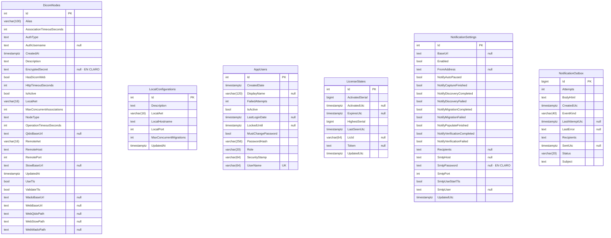

### Inventario (descubrimiento)

Un job recorre el PACS por particiones (día; si la respuesta llega truncada, franjas horarias cada vez más cortas y, en último caso, modalidad) y guarda cada estudio una vez por job. La captura de nivel 2 añade los SOPInstanceUID de cada estudio.

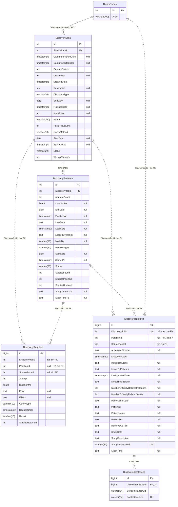

### Migración

Una migración copia estudios del inventario (o los importa directamente) y guarda en `MigrationInstances` los UID de origen para la verificación de nivel 2.

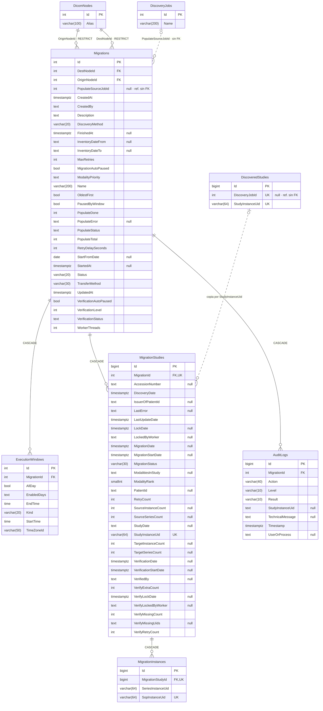

`StudyDate` se guarda como texto DICOM `YYYYMMDD`, no como fecha: el orden y los filtros por fecha dependen de que el PACS siempre devuelva ese formato exacto (lo advierte el propio código de `AcquireNextPendingAsync`).

`ModalityRank` es la posición de la primera modalidad del estudio en la lista de prioridad de la migración (999 si no está). Se recalcula al iniciar o reanudar la migración, solo en las filas `Pending` o `RetryPending` cuyo valor cambia, y es la primera columna del orden de la cola.

## 2 · Índices

23 índices

Además de las claves primarias. Los marcados como *convención* no están en `AppDbContext`: EF los crea solo para cada clave foránea.

| Tabla | Índice | Columnas | Tipo | Para qué sirve |
| --- | --- | --- | --- | --- |
| MigrationStudies | IX_MigrationStudies_MigrationId_StudyInstanceUid | MigrationId, StudyInstanceUid | único | Un estudio no puede estar dos veces en la misma migración. |
| MigrationStudies | IX_MigrationStudies_MigrationId_MigrationStatus | MigrationId, MigrationStatus | normal | Recuentos por estado del panel y comprobaciones de trabajo pendiente. |
| MigrationStudies | IX_MigStudies_queue_newest | MigrationId, ModalityRank, RetryCount, StudyDate DESC, Id | parcial | Solo filas `Pending`. Cola de migración con los estudios más recientes primero: el worker toma el primero libre recorriendo el índice en orden, sin ordenar los pendientes. |
| MigrationStudies | IX_MigStudies_queue_oldest | MigrationId, ModalityRank, RetryCount, StudyDate, Id | parcial | Igual, para las migraciones con «más antiguos primero». |
| MigrationStudies | IX_MigStudies_verify_queue | MigrationId, Id | parcial | Solo filas `Migrated`: cola de verificación. |
| MigrationStudies | IX_MigStudies_Mig_Patient | MigrationId, PatientId | normal | Búsqueda por paciente en la tabla de migración. |
| MigrationStudies | IX_MigStudies_Mig_Accession | MigrationId, AccessionNumber | normal | Búsqueda por número de acceso. |
| MigrationStudies | IX_MigStudies_Mig_DiscDate | MigrationId, DiscoveryDate | normal | Orden y paginación por fecha de alta. |
| MigrationInstances | IX_MigInstances_Study_Sop | MigrationStudyId, SopInstanceUid | único | UID de origen por estudio para la verificación de nivel 2; evita duplicados al copiar. |
| DiscoveredStudies | IX_DiscoveredStudies_DiscoveryJobId_StudyInstanceUid | DiscoveryJobId, StudyInstanceUid | único | Un estudio una sola vez por job: es la clave del upsert del descubrimiento. |
| DiscoveredStudies | IX_DiscoveredStudies_SourcePacsId_StudyDate | SourcePacsId, StudyDate | normal | Rango de fechas del inventario por PACS de origen. |
| DiscoveredStudies | IX_DiscoveredStudies_PartitionId | PartitionId | normal | Estadísticas de estudios por partición. |
| DiscoveredInstances | IX_DiscInstances_Study_Sop | DiscoveredStudyId, SopInstanceUid | único | UID capturados por estudio (nivel 2), sin duplicados. |
| DiscoveryPartitions | IX_DiscoveryPartitions_DiscoveryJobId_Status | DiscoveryJobId, Status | normal | Los workers toman la siguiente partición `Pending` del job. |
| DiscoveryRequests | IX_DiscoveryRequests_DiscoveryJobId | DiscoveryJobId | normal | Registro de consultas al PACS por job. |
| AuditLogs | IX_AuditLogs_MigrationId_Timestamp | MigrationId, Timestamp | normal | Auditoría de una migración ordenada por fecha. |
| AuditLogs | IX_AuditLogs_Timestamp | Timestamp | normal | Purga de entradas antiguas y vista global reciente. |
| AppUsers | IX_AppUsers_UserName | UserName | único | Inicio de sesión; nombres de usuario no repetidos. |
| NotificationOutbox | IX_NotificationOutbox_Status_Id | Status, Id | normal | El repartidor toma los correos `Pending` en orden de llegada. |
| Migrations | IX_Migrations_OriginNodeId | OriginNodeId | convención | Clave foránea al nodo de origen. |
| Migrations | IX_Migrations_DestNodeId | DestNodeId | convención | Clave foránea al nodo de destino. |
| ExecutionWindows | IX_ExecutionWindows_MigrationId | MigrationId | convención | Clave foránea a la migración. |
| DiscoveryJobs | IX_DiscoveryJobs_SourcePacsId | SourcePacsId | convención | Clave foránea al PACS de origen. |

- **Cola de migración:** los dos índices tienen las mismas columnas con distinto orden de fecha, por eso llevan nombre propio en `AppDbContext` (sin él, EF los fundiría en uno). Los `RetryPending` no están en ellos: se toman con una segunda consulta solo cuando no queda ningún `Pending`.
- **Sin índice a propósito:** `ModalitiesInStudy`. El filtro de modalidad busca por subcadena (filtrar por `CT` trae también `RTSTRUCT`), y un B-tree no resuelve búsquedas en mitad del texto; `pg_trgm` necesitaría al menos tres caracteres. El filtro va casi siempre acotado por job, que sí usa índice.

## 3 · Ciclo de vida de los estados

Repositorios y servicios

Valores reales que el código asigna a cada columna de estado y qué los provoca. Las transiciones de rescate devuelven a la cola el trabajo que se quedó a medias si el proceso muere de golpe.

### MigrationStudies.MigrationStatus

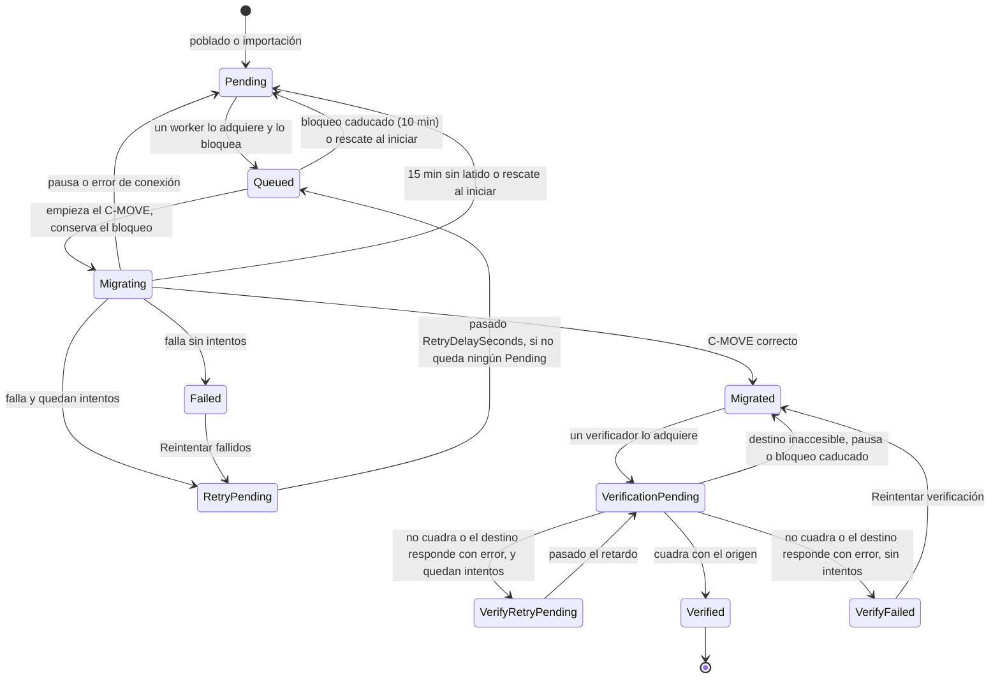

- **Adquisición atómica:** un solo `UPDATE … WHERE Id = (SELECT … ORDER BY … LIMIT 1 FOR UPDATE SKIP LOCKED) RETURNING *` pasa el estudio a `Queued` (o a `VerificationPending` en la verificación) y lo bloquea. Cada worker obtiene uno distinto sin esperar a los demás. Orden de la cola de migración: `ModalityRank`, `RetryCount`, `StudyDate` (según «más antiguos primero») e `Id`.
- **Rescate tras una caída:** `MarkMigratingAsync` conserva `LockedByWorker` y `LockDate`, y un latido renueva `LockDate` cada minuto mientras dura el C-MOVE. Un estudio en `Migrating` sin latido durante 15 minutos vuelve a `Pending`. Además, al iniciar o reanudar la migración, `ReleaseOrphanMigrationLocksAsync` devuelve a `Pending` todos los `Queued` y `Migrating`, tras esperar hasta 60 s a que terminen los workers de la ejecución anterior. Ninguno de los dos rescates consume reintentos.
- **Workers con el mismo nombre:** los nombres (`WORKER-1`…) se repiten entre migraciones, así que la liberación de bloqueos al terminar un worker filtra también por migración.
- **Acciones manuales:** «Cancelar» lleva el estudio a `Cancelled`; «Reiniciar» devuelve `Failed`, `Cancelled`, `Verified` o `Migrated` a `Pending`.
- **Contadores:** `RetryCount` sube al pasar a `RetryPending`; «Reintentar fallidos» no lo reinicia, así que da un solo intento más. `VerifyRetryCount` sube en cada verificación fallida y «Reintentar verificación» lo pone a 0.
- **Verificación sin respuesta frente a respuesta con error:** si el destino no responde (caído, red, HTTP 502/503/504/429/408), el estudio vuelve a `Migrated` sin gastar `VerifyRetryCount`. Si responde con un error a la consulta del estudio (estado DIMSE de fallo, HTTP 400/413/500…), cuenta como intento fallido.
- `VerifiedBy` no es un estado: indica qué comprobación se aplicó (`UidSet`, `Counts` o `ExistenceOnly`).

### Migrations.Status

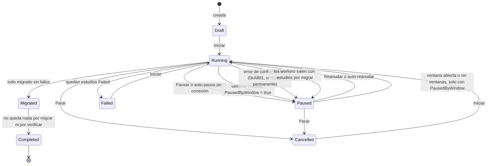

El comentario del modelo lista `Ready`, pero ningún código lo asigna; y omite `Migrated`, que sí se usa («migrada, pendiente de verificar»).

- **Auto-pausa por conexión** (`MigrationAutoPaused = true`): 5 fallos transitorios seguidos (origen caído o saturado, destino que no responde). La auto-reanudación comprueba con C-ECHO el origen y el destino; si se reanuda y vuelve a pausarse sin migrar nada, no se repite el correo y cada intento espera el doble (1, 2, 4… hasta 30 min).
- **Error de configuración:** pausa sin `MigrationAutoPaused`, así que no se reanuda sola.
- **Ventana horaria** (`PausedByWindow`): el planificador mira el estado cada minuto, no la transición. Si la migración está en `Running` con la ventana cerrada, la pausa y pone `PausedByWindow = true`; si está en `Paused` con esa marca y la ventana abierta (o ya no tiene ventanas), la reanuda. Cualquier inicio, reanudación o pausa manual borra la marca, así que una pausa manual no se reanuda al abrirse la ventana. Al estar en la base, sobrevive a un reinicio.
- **Paso a `Completed`:** lo hace quien termine último. La verificación, al acabar sin nada pendiente con la migración ya en `Migrated`; o la migración, al terminar con la verificación al día.

### Migrations.VerificationStatus

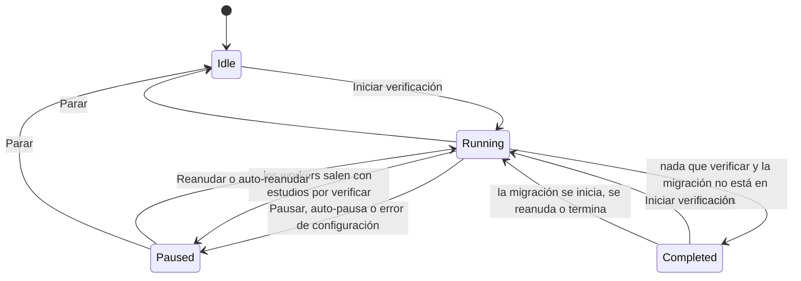

Va por separado de `Status`: se puede migrar y verificar a la vez.

- **Espera:** con la migración en `Running` y estudios por migrar, los verificadores no salen al vaciar su cola; esperan (sondeo cada 30 s) a que lleguen más `Migrated`.
- **`Completed` puede significar «al día»:** si la verificación termina con estudios aún por migrar (migración en pausa o sin iniciar), queda en `Completed` sin correo ni promoción, y la migración la relanza al iniciarse, reanudarse o terminar. Una verificación en `Paused` o `Idle` no se relanza sola.
- **Auto-pausa** (`VerificationAutoPaused = true`): la auto-reanudación comprueba el destino con el protocolo con el que se verifica (QIDO-RS si tiene DICOMweb, C-ECHO si no). Credenciales o AE Title rechazados, un HTTP 404 en la búsqueda QIDO-RS (URL mal configurada) o 5 estudios seguidos con error de consulta pausan sin auto-pausa: no se reanuda sola.

### DiscoveryJobs.Status

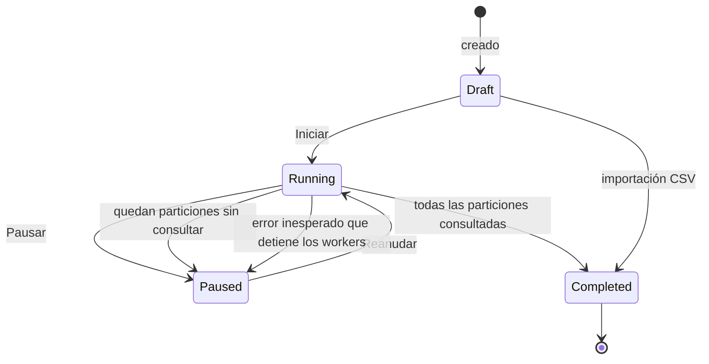

Si los workers terminan y aún quedan particiones `Pending` o `Running`, el job no se da por completado: queda en `Paused` para reanudarlo. `Failed` y `Cancelled` están documentados, pero ningún código los asigna.

- **Fallos de la base de datos:** un fallo pasajero (conexión perdida, PostgreSQL reiniciándose) no detiene a los workers: la partición vuelve a `Pending` sin gastar intento y se reintenta con espera creciente hasta que la base responde. Los errores de datos, en cambio, marcan la partición `Failed`.
- **Error inesperado:** si aun así los workers se detienen (5 errores inesperados seguidos, o un fallo al cerrar el job), se rescatan las particiones `Running` y el job pasa a `Paused`, en lugar de quedarse `Running` sin workers.
- **Reinicio del servicio:** al arrancar se reanudan los jobs que estaban en `Running`.

### DiscoveryPartitions.Status

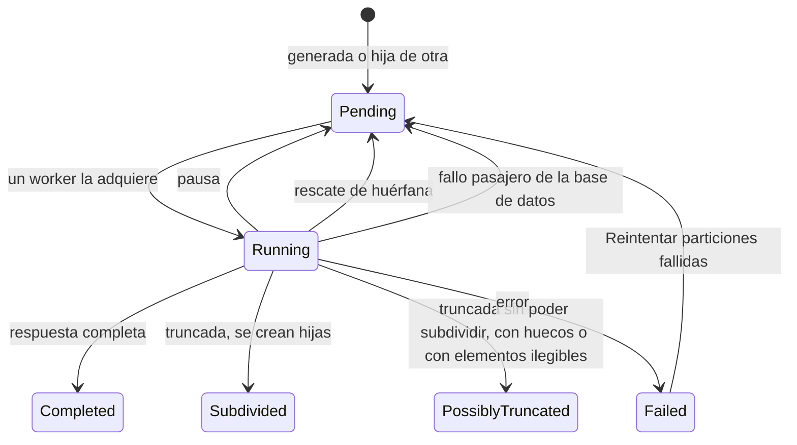

- **Tipos:** `Day` → `DayTime` (4 franjas de 6 h, luego bisección hasta 5 min) → `DayTimeModality` (franja mínima aún truncada: una hija por modalidad, último nivel). Los tipos antiguos `DayModality` y `DayModalityTime` se siguen procesando en los jobs que ya los tenían.
- **`PossiblyTruncated`:** la partición está truncada en el último nivel; o se subdividió, pero la subdivisión no garantiza cubrir todo (estudios sin hora, reparto por modalidad), y entonces las hijas se procesan igual; o la respuesta traía elementos que no se pudieron leer. El motivo queda en `LastError`.

Una partición que se queda en `Running` tras una caída vuelve a `Pending` al iniciar o reanudar el job (tras esperar hasta 60 s a los workers anteriores) y al acabar cada ronda de workers, con un máximo de 3 rondas. No consume `AttemptCount`.

### DiscoveryJobs.CaptureStatus

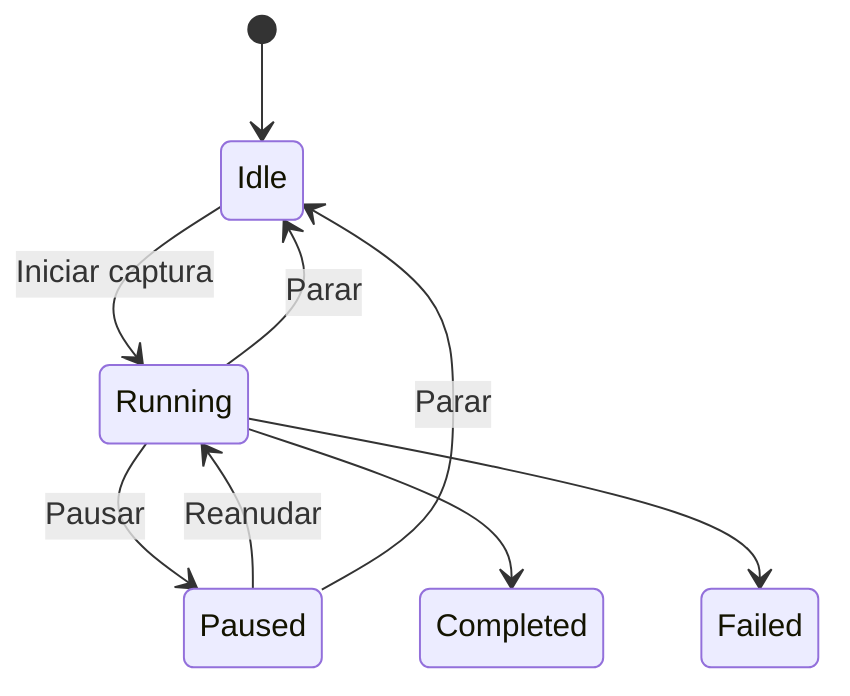

### Migrations.PopulateStatus

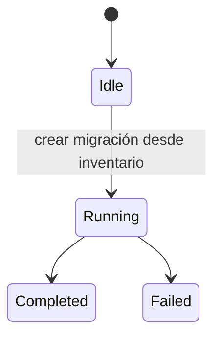

`PopulateSourceJobId` permite reanudarlo si el servicio se reinicia a mitad.

### NotificationOutbox.Status

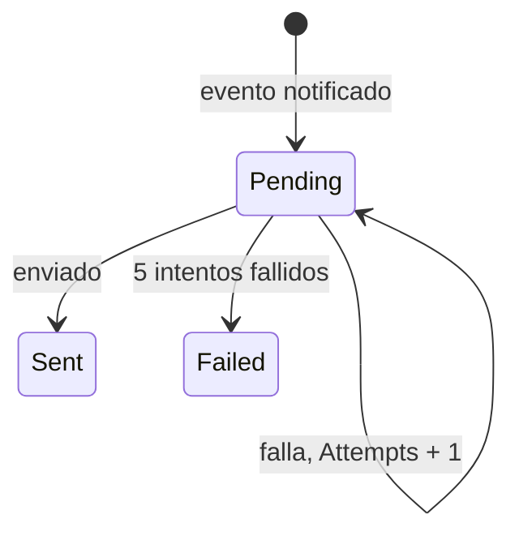

## 4 · Flujo de datos entre tablas

Procesos → tablas

Qué proceso escribe en cada tabla, en el orden en que circulan los datos: del PACS de origen al inventario, del inventario a la migración, y de ahí a auditoría y notificaciones.

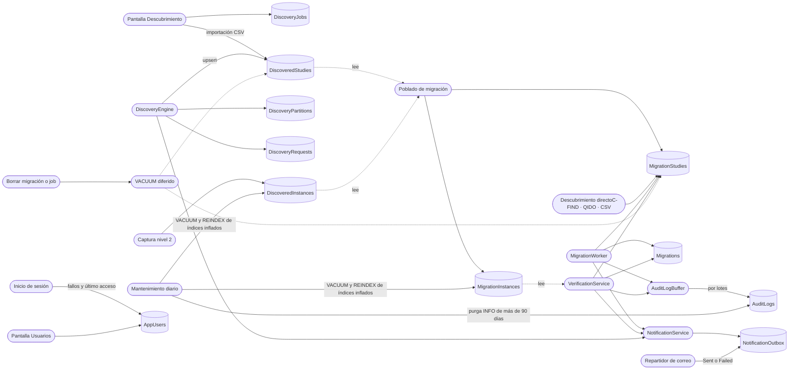

La auditoría no se escribe en el momento: va a un búfer en memoria que se vuelca por lotes. Si el proceso muere de golpe, se pierden las entradas aún no volcadas.

El mantenimiento actúa sobre las siete tablas de más movimiento (`MigrationStudies`, `MigrationInstances`, `DiscoveredStudies`, `DiscoveredInstances`, `DiscoveryPartitions`, `DiscoveryRequests` y `AuditLogs`). El diagrama solo dibuja las flechas principales.

Esquema: Infrastructure/Migrations/AppDbContextModelSnapshot.cs, contrastado con la base local (pg_constraint, pg_indexes, pg_stat_user_tables). Estados y flujos: repositorios y servicios de Infrastructure y páginas de Web, leídos del directorio de trabajo del proyecto (commit 9814440, 10 oct 2026).